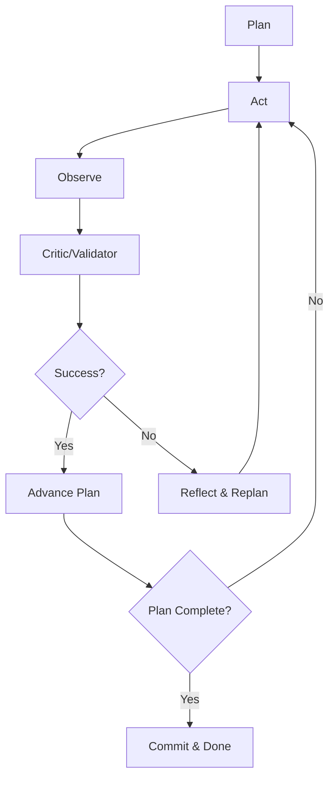

# Autonomous Agent Implementation

This document outlines the autonomous, tool-using agent extension added to the existing AI Chat Copilot in StudioSix Pro.

## ✅ Implementation Status

All requested features have been implemented with surgical precision while maintaining full backward compatibility:

### Core Services Created

- **`AgentConfigService.js`** - Central configuration management with per-run overrides and persistence
- **`AutonomousAgent.js`** - Main plan→act→observe→reflect loop with adaptive re-planning
- **`CriticValidator.js`** - Design quality and safety validation (building codes, ergonomics, structural)
- **`DocumentCheckpointService.js`** - Transactional checkpoints for rollback capability
- **`ToolCapabilityRegistry.js`** - Dynamic tool discovery with success rate tracking
- **`EventManager.js`** - WebSocket progress streaming and approval handling

### Enhanced Existing Services

- **`AgentManager.js`** - Added autonomous agent wrapper methods
- **`AICommandExecutor.js`** - Exposed `getHandlers()` for tool registry integration
- **`AIService.js`** - Added memory hygiene with context pruning
- **`simple-server.js`** - Added autonomous agent API endpoints and WebSocket server

### UI Updates

- **`NativeAIChat.js`** - Added "Autonomous (Beta)" toggle, WebSocket integration, bulk approval UI

## 🔄 Plan → Act → Observe → Reflect Loop



### Key Features Implemented

✅ **Adaptive Re-planning** - Automatically generates new plans when actions fail or critic rejects
✅ **Critic/Validator** - Validates against building codes, safety constraints, and design quality
✅ **Configurable Limits** - Max steps, timeouts, approval modes (per run + global defaults)
✅ **Bulk Approvals** - WebSocket-based approval requests for destructive operations
✅ **Tool Registry** - Dynamic capability discovery with success rate tracking
✅ **Transactional Rollback** - Checkpoint/rollback system for multi-step operations
✅ **Memory Hygiene** - Context pruning and history management
✅ **Real-time Streaming** - WebSocket progress updates (multi-user ready)

## 🛠️ API Endpoints

### Start Autonomous Run
```bash
POST /api/agent/run
{
  "goal": "Create a 4x3m bedroom with door and window",
  "context": { "selectedTool": "wall", "viewMode": "3d" },
  "overrides": { "maxSteps": 8, "approvalMode": "destructive" },
  "userId": "user123"
}
```

### Approve/Reject Action
```bash
POST /api/agent/approve
{
  "runId": "run_123456789_abc",
  "approved": true,
  "reason": "User approved"
}
```

### WebSocket Connection
```javascript
const ws = new WebSocket('ws://localhost:8081/ws/agent?runId=run_123');
ws.onmessage = (event) => {
  const { type, tool, verdict, status } = JSON.parse(event.data);
  // Handle: plan, act, observe, critic, replan, approval-request, done
};
```

## 🎛️ Configuration Options

```javascript
const config = {
  maxSteps: 12,                    // Maximum steps per run
  maxMillis: 60_000,               // Maximum time per run (1 minute)
  approvalMode: 'destructive',     // 'always', 'never', 'destructive'
  allowedTools: [
    'geometry.createWall',
    'geometry.createStair', 
    'transform.move',
    'document.commitCheckpoint'
  ],
  enableCritic: true,              // Enable design quality validation
  enableLearning: true,            // Enable tool outcome tracking
  enableCheckpoints: true,         // Enable transactional rollback
  historyLimit: 20                 // Max conversation history items
}
```

## 🔍 Critic/Validator Rules

The critic validates against architectural standards:

### Building Code Validation
- **Stairs**: Riser height (150-190mm), tread depth (250-320mm), 2R+T comfort rule
- **Doors**: Width (800-1200mm), height (2000-2400mm)
- **Windows**: Egress requirements, sill height safety (800mm min)

### Structural Validation  
- **Walls**: Minimum thickness (100mm), maximum height (4.5m)
- **Columns**: Diameter minimums, slenderness ratios
- **Beams**: Span-to-depth ratios
- **Slabs**: Thickness-to-span ratios

### Safety Constraints
- Prevents objects below ground level
- Extreme scaling limitations (0.1-10.0x)
- Landing depth requirements for stairs

## 🧠 Tool Capability Registry

Tracks tool performance and enables smart recommendations:

```javascript
// Tools are automatically categorized
const categories = {
  geometry: ['createWall', 'createStair', 'createDoor'],
  selection: ['select', 'clear', 'invert'], 
  transform: ['move', 'rotate', 'scale'],
  analysis: ['structural', 'spatial'],
  document: ['commitCheckpoint', 'undo', 'redo']
};

// Success rates influence replanning
const recommendedTools = registry.getRecommendedTools('geometry', 0.7); // 70%+ success rate
```

## 📦 Transactional System

Provides ACID-like properties for multi-step operations:

```javascript
await beginTransaction();    // Create checkpoint
try {
  await executeSteps();      // Multi-step execution
  await commitTransaction(); // Finalize changes
} catch (error) {
  await rollbackTransaction(); // Restore to checkpoint
}
```

## 🔄 Memory Hygiene

Automatic cleanup to prevent memory bloat:

- **Conversation History**: Pruned to last N messages (configurable)
- **File Uploads**: Large preview data removed, metadata retained  
- **Object Collections**: Limited to 100 items, excess noted
- **Viewport Data**: Detailed geometry pruned, essentials kept
- **Event Histories**: Time-based cleanup (24 hours)

## 🎯 Usage Examples

### Basic Room Creation
```javascript
// User: "Create a 4x3m bedroom"
// Agent automatically:
// 1. Plans: Slab → Walls → Door → Joinery
// 2. Executes each step with critic validation
// 3. Adapts plan if critic rejects (e.g., wall too thin)
// 4. Streams progress in real-time
// 5. Requests approval for destructive operations
```

### Stair Creation with Validation
```javascript  
// User: "Create stairs with 15cm risers"
// Agent:
// 1. Plans stair creation
// 2. Critic validates: 150mm risers are within code (150-190mm)
// 3. Proceeds with creation
// 4. If user said "25cm risers" → Critic rejects → Replans with code-compliant dimensions
```

### Error Recovery
```javascript
// If tool fails or critic rejects:
// 1. Agent reflects on failure reason
// 2. Consults tool registry for better alternatives
// 3. Generates new plan with higher-success-rate tools
// 4. Retries with adapted approach
// 5. Rollback if max attempts exceeded
```

## 🧪 Testing

Test suites verify core functionality:

### `tests/agent.loop.spec.js`
- ✅ Successful plan→act→observe→reflect cycle  
- ✅ Failure triggers replan with adjusted parameters
- ✅ Rollback on user rejection or errors
- ✅ Proper call sequence verification

### `tests/tools.registry.spec.js`  
- ✅ Tool registration and success/failure tracking
- ✅ Dynamic handler discovery from AICommandExecutor
- ✅ Recommendation based on success rates
- ✅ Disabled tool handling

## 🚀 Getting Started

1. **Enable Autonomous Mode**: Toggle "Auto" switch in chat UI
2. **Send Request**: Type natural language command (e.g., "Create a 3x4m office")
3. **Monitor Progress**: Watch real-time plan→act→observe→reflect cycle  
4. **Approve Actions**: Click Approve/Reject for destructive operations
5. **Review Results**: Agent completes autonomously or reports issues

## 🔒 Safety & Security

- **No Chain-of-Thought Exposure**: Only concise summaries streamed to UI
- **API Key Protection**: BYOK handling maintained, keys never logged
- **Subscription Enforcement**: All existing limits and usage tracking preserved
- **Transactional Rollback**: Failed operations don't leave partial state
- **Approval Gates**: Destructive operations require user confirmation

## 🔧 Production Considerations

- **Redis Integration**: Replace in-memory maps with Redis for scalability
- **Database Persistence**: Store agent runs, approvals, and statistics  
- **Monitoring**: Add metrics for success rates, execution times, user satisfaction
- **Rate Limiting**: Prevent abuse with per-user autonomous run limits
- **Load Balancing**: WebSocket sticky sessions for multi-server deployments

## 📚 Architecture Integration

The autonomous agent extends the existing architecture without breaking changes:

- **Backward Compatible**: Traditional chat flow unchanged
- **Service Oriented**: New services integrate cleanly with existing ones
- **Event Driven**: WebSocket streams decouple UI from execution
- **Configurable**: Behavior tunable per user preferences
- **Extensible**: New tools/validators easily added to registry

The implementation provides a robust foundation for autonomous CAD operations while maintaining the polished UX of the existing sequential execution system.